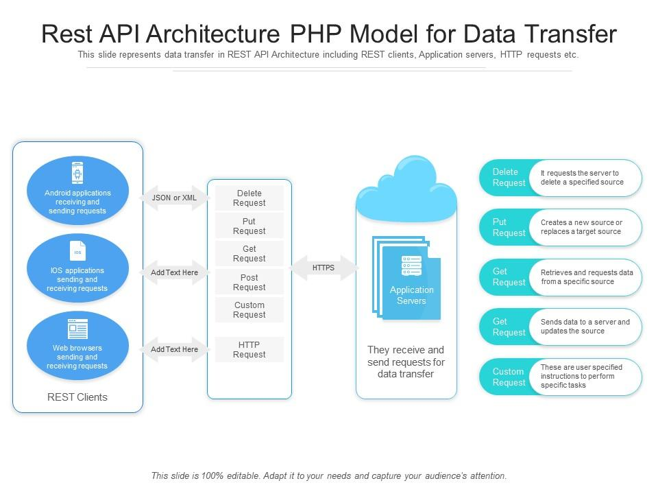

## APIs

### What are APIs?
APIs, or Application Programming Interfaces, are sets of rules and protocols that allow different software applications to communicate with each other. They define how software components should interact, enabling developers to access the functionality of other applications or services
## How Are APIs used and why are they popular?

APIs are used to enable communication and data exchange between different software systems, allowing developers to build applications that leverage existing services or functionalities. They are popular because they promote interoperability, code reuse, and modularity, and they simplify the process of integrating disparate systems.

## What are REST APIs? What makes an API Restful?

REST APIs, or Representational State Transfer APIs, are a type of API architecture that follows the principles of REST. RESTful APIs use standard HTTP methods (such as GET, POST, PUT, DELETE) and adhere to a set of architectural constraints, such as statelessness, uniform interface, and client-server separation. These constraints help to make APIs scalable, maintainable, and easy to understand and use.

## What is HTTP?

HTTP stands for Hypertext Transfer Protocol. It is the foundation of data communication for the World Wide Web and is used for transmitting hypermedia documents, such as HTML files, over the internet.

## What are the 5 HTTP verbs
The 5 HTTP verbs, also known as HTTP methods, are:

GET
POST
PUT
DELETE
PATCH

Cover:

Find a diagram that showcases the API data transfer process. Add it to your README

 

Find diagrams that showcase:
 
- HTTP Request Structure
- HTTP Response Structure
 
